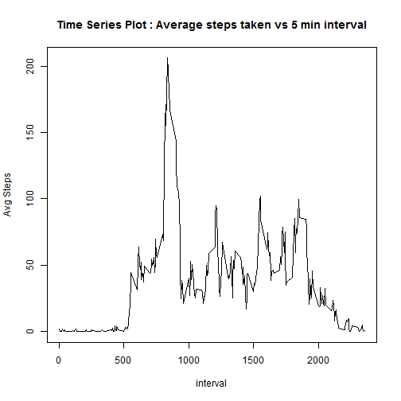
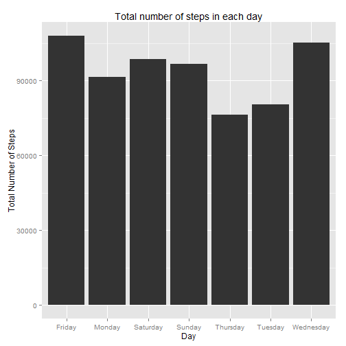
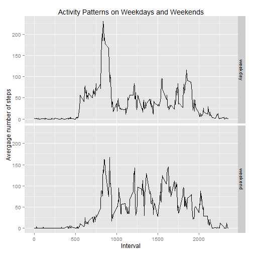

# Peer Assessment 1


```r
library(ggplot2)
library(dplyr)
rm(list = ls())
```


## What is the average daily activity pattern?

### 1.Time Series Plot


```r
amd <- read.csv("activity.csv")

amdagg <- aggregate(steps ~ interval,data = amd,FUN = "mean")

with(amdagg,plot(interval,steps,type = "l",ylab = "Avg Steps",main = "Time Series Plot : Average steps taken vs 5 min interval" ))
```

 

### 2.Maximum number of steps for a 5 minute interval


```r
filter(amdagg,steps == max(amdagg$steps))
```

```
##   interval    steps
## 1      835 206.1698
```

## Inputing Missing Values

### 1.Report total number of missing values in the data set.


```r
nrow(filter(amd,(is.na(steps) | is.na(date) | is.na(interval)))) 
```

```
## [1] 2304
```

### 2.Strategy for filling the missed values.Filling by mean! 


```r
amd_rm <- filter(amd,(is.na(steps) | is.na(date) | is.na(interval)))

amd_non_rm <- filter(amd,(!is.na(steps) & !is.na(date) & !is.na(interval)))

amd_rm <- inner_join(amd_rm,amdagg,by = "interval")

names(amd_rm)  <- c("steps_old","date","interval","steps")

amd_rm  <- amd_rm[c("steps","date","interval")]

amd_new <- rbind(amd_rm,amd_non_rm)
```

### 3.New data set with no missing data.


```r
head(amd_new)
```

```
##       steps       date interval
## 1 1.7169811 2012-10-01        0
## 2 0.3396226 2012-10-01        5
## 3 0.1320755 2012-10-01       10
## 4 0.1509434 2012-10-01       15
## 5 0.0754717 2012-10-01       20
## 6 2.0943396 2012-10-01       25
```

```r
nrow(filter(amd_new,(is.na(steps) | is.na(date) | is.na(interval))))
```

```
## [1] 0
```

### 4.Histograms of steps.


```r
amdagg <- mutate(amd_new,weekday = weekdays(as.Date(date)))
amdagg <- aggregate(amdagg$steps,by = list(amdagg$weekday),FUN = "sum")
names(amdagg) <- c("Day","Steps")

g <- ggplot(amdagg,aes(x = Day,y = Steps))

g <- g + geom_bar(stat = "identity")

g <- g + labs(title = "Total number of steps in each day") + labs(y = "Total Number of Steps" )

print(g)
```

 

```r
mean_old <- mean(amd$steps,na.rm = TRUE)

median_old <- median(amd$steps,na.rm = TRUE)

mean_new <- mean(amd_new$steps)

median_new <- median(amd_new$steps)
```

The new mean is 37.3825996.The old mean was 37.3825996.The new median is 0.The old median was 0.

####There was no impact in imputing the data!


## Activity Patterns between Weekdays and Weekends

### 1.Data with new weekday and weekend variables.


```r
amd_new <- mutate(amd_new,weekday = weekdays(as.Date(date)))
amd_new$day  <- sapply(amd_new$weekday,switch,Monday = 'weekday',Tuesday = 'weekday',Wednesday = 'weekday',Thursday = 'weekday',
                       Friday = 'weekday',Saturday = 'weekend',Sunday = 'weekend') 
amd_new[,5] <- as.factor(amd_new[,5])

head(amd_new)
```

```
##       steps       date interval weekday     day
## 1 1.7169811 2012-10-01        0  Monday weekday
## 2 0.3396226 2012-10-01        5  Monday weekday
## 3 0.1320755 2012-10-01       10  Monday weekday
## 4 0.1509434 2012-10-01       15  Monday weekday
## 5 0.0754717 2012-10-01       20  Monday weekday
## 6 2.0943396 2012-10-01       25  Monday weekday
```

```r
str(amd_new)
```

```
## 'data.frame':	17568 obs. of  5 variables:
##  $ steps   : num  1.717 0.3396 0.1321 0.1509 0.0755 ...
##  $ date    : Factor w/ 61 levels "2012-10-01","2012-10-02",..: 1 1 1 1 1 1 1 1 1 1 ...
##  $ interval: int  0 5 10 15 20 25 30 35 40 45 ...
##  $ weekday : chr  "Monday" "Monday" "Monday" "Monday" ...
##  $ day     : Factor w/ 2 levels "weekday","weekend": 1 1 1 1 1 1 1 1 1 1 ...
```

### 2.Activity patterns on weekdays and weekends comparisions.


```r
amdagg <- aggregate(amd_new$steps,by = list(amd_new$interval,amd_new$day),FUN = "mean")
names(amdagg) <- c("Interval","Day","Steps")
g <- ggplot(amdagg,aes(x = Interval,y = Steps))
g <- g + geom_line(aes(group = 1))
g <- g + facet_grid(Day ~ .)
g <- g + labs(title = "Activity Patterns on Weekdays and Weekends") + labs(y = "Avergage number of steps" )
print(g)
```

 


